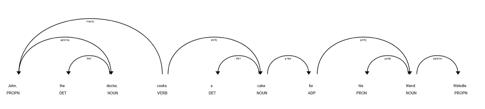

# 💃 Damsel in distress: a recurrent pattern in movies? 

#* Data story website: https://eerror141.github.io/

## Notebook structure 

## Abstract
The damsel in distress is a standard narrative device that portrays female protagonists in the face of perilous situations as completely helpless. Indeed, they constantly need a male savior to help them escape their dangerous predicaments. Their agency is completely stripped away from them. More generally, women in the media are often portrayed as passive participants of narratives. They are only tools to provide motivation and purpose to the lead male characters. Using the movie summary corpus, our project aims to explore the "activeness" of female characters in movies and its evolution through time. Using natural language processing, the latter would be performed by searching for verbs and adjectives associated with the female characters in the summary and by investigating what type of power it gives to it. For homogeneity reasons, we decided to focus on US movies since 1940.

## Research questions: 
* How has the role of women in American cinema evolved through the decades? 
* Are women having more active roles lately? Is this activeness more related to the film genres that women usually play in, for example, family or romantic movies? 
* What action are most often associated with female characters? Are they different from the ones associated with their male counterpart?
* Can we predict a character’s gender from the verbs and adjectives associated with them?

## Additional dataset
As an additional dataset, we use the IMDb dataset (https://www.imdb.com/interfaces) to compare the distribution of movies by release year and genres of the CMU and all IMDb movies.

## Methods
Before starting the analysis of the plot summaries, data exploration is performed.

First, we notice that the distribution of movies through time in the CMU dataset reflects the total distribution of films released worldwide as their evolution is similar. Additionally, the distribution of the genres of movies in our dataset is comparable to the distribution of all movies on IMDb. 
A first analysis of movie-producing countries shows that the United States is the main producer in the 20th century and early 21st century. In order to study an evolution, the project is based on American movies. Indeed, they constitute the largest component of the dataset and so as to avoid possible bias caused by different countries of production and consequently different cultures, we decided to restrain our analysis over this subset. 
Next, we assess that the distribution of the U.S. dataset reflects the distribution of the total dataset in terms of genre. We only considered movies released since 1940 as the number of movies released the years before was too low for a meaningful analysis.

In order to confirm the statement that female characters are less empowered than male characters, we first compared the number of female vs male characters in movies (32% female vs 68% male) which shows that women are much less represented. 

  

As previously mentioned in the abstract, the typical role of the character depending on the gender is very different. To visualize this point, we plotted the genres of the movies by order of highest number of male characters and the top 10 were kept. A similar plot was performed by considering the female characters. Even though some of the genres are shared by both plots, the distribution is not the same. For example, 5 out of 10 of the top genres of female characters are related to romance, family or music whereas male characters are much more present in movies related to action, danger and adventure. To attempt to get a general idea of the evolution of these numbers, we investigated the possible increase of female characters in two stereotypical genres for male and female characters. A general trend of decrease in the difference between the percentage of male and female characters can be observed.
These preliminary results support the aim of the project.
For the summary to be moderately representative of the movie scenario and the type of role of the main characters, it is necessary to exploit only the summaries that have at least 350 words. The last and the previously mentioned restrictions yield a subset of 7714 movies. However, note that there is a bias in the content of the summaries due to the fact that most Wikipedia writers (around 85%) are men.[[1]]

Taking into account the presented data exploration, we are convinced that the dataset is sufficient and complete enough to perform the summary plots analysis.

Here is the intended pipeline for the summary analysis. We first start by clustering the name of the character with all its references, including pronouns and the nouns referring to it such as the doctor, the girl, and so on in order to replace the references by the true name of the character. For this, we use a neural network specially trained for coreference resolution from AllenNLP library. Additionally, the gender of each character is determined thanks to the pronouns in the cluster of each character. If some genders remain undefined, first, the character metadata is used, then, if necessary a gender discriminator from the gender_guesser library is employed. Next, grammatical tagging is performed on the summary using the POS module from the spacy NLP library. According to the verb tense, it is classified as active or passive verb and a list per category is generated for each character. Moreover, descriptive adjectives and nouns are also extracted. 

  

Furthermore, the type of each verb in terms of activeness of the meaning will be determined. The latter can be achieved by using a dictionary, sentiment analysis or manual labeling into action vs description. Finally, an activeness score is attributed to each character which will be used to predict the gender of unknown characters.

[1]: https://en.wikipedia.org/wiki/Gender_bias_on_Wikipedia 

## Proposed timeline

21.11.2022-Optimize and complete NLP summary pipeline  
28.11.2022-Pause 
02.12.2022-**Homework 2 Deadline**  
05.12.2022-Process all summaries through NLP pipeline, and define activeness score  
12.12.2022-Visualisation of the results  
19.12.2022-Develop the web interface and the data story  
23.12.2022-**Milestone 3 Deadline**

## Team Organization
<table class="tg" style="undefined;table-layout: fixed; width: 342px">
<colgroup>
<col style="width: 164px">
<col style="width: 178px">
</colgroup>
<thead>
  <tr>
    <th class="tg-0lax"></th>
    <th class="tg-0lax">Tasks</th>
  </tr>
</thead>
<tbody>
  <tr>
    <td class="tg-0lax">Alexia Dormann</td>
    <td class="tg-0lax">Optimize NLP pipeline, develop the web interface
</td>
  </tr>
  <tr>
    <td class="tg-0lax">Imane Wifak</td>
    <td class="tg-0lax">Optimize NLP pipeline, data visualization of results</td>
  </tr>
  <tr>
    <td class="tg-0lax">Imane Ben M'Rad</td>
    <td class="tg-0lax">Process all summaries, data visualization of results
</td>
  </tr>
  <tr>
    <td class="tg-0lax">Theo Maffei</td>
    <td class="tg-0lax">Define and compute the activeness score, develop the web interface
</td>
  </tr>
  <tr>
    <td class="tg-0lax">All</td>
    <td class="tg-0lax">Develop the final data story

</td>
  </tr>
</tbody>
</table>
